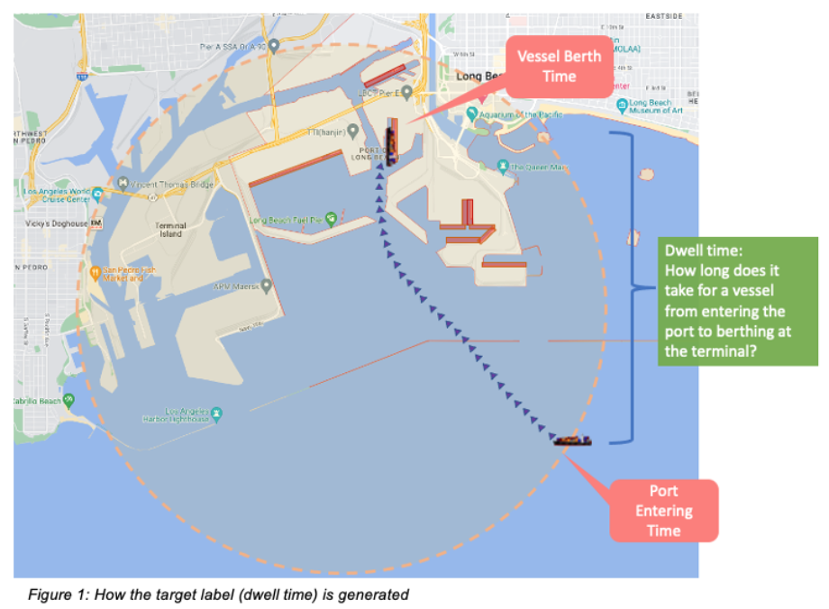
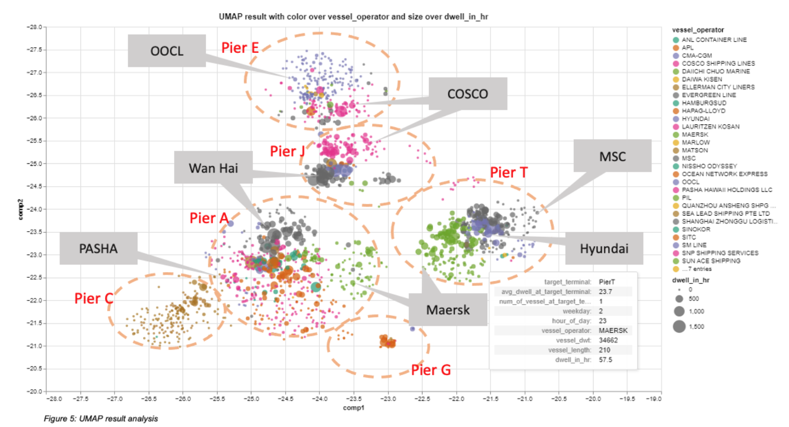
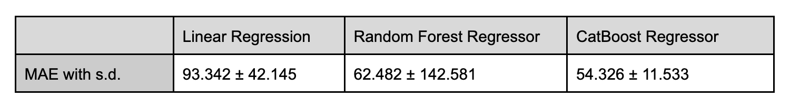
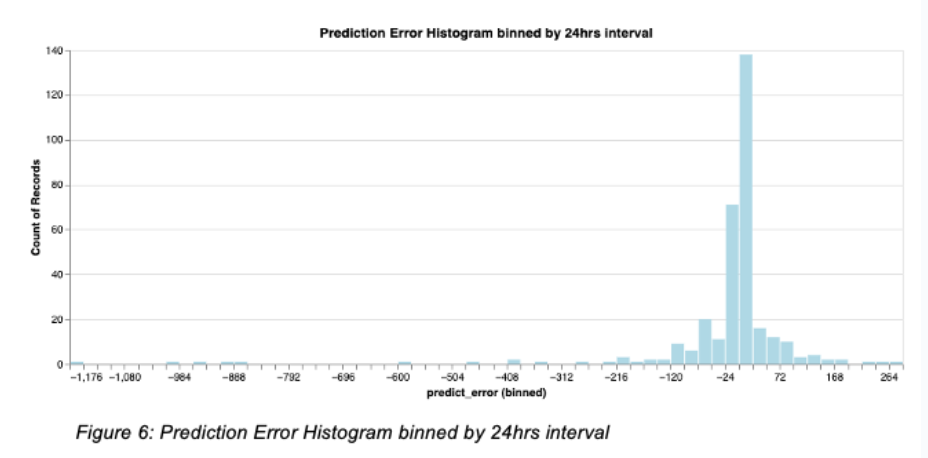
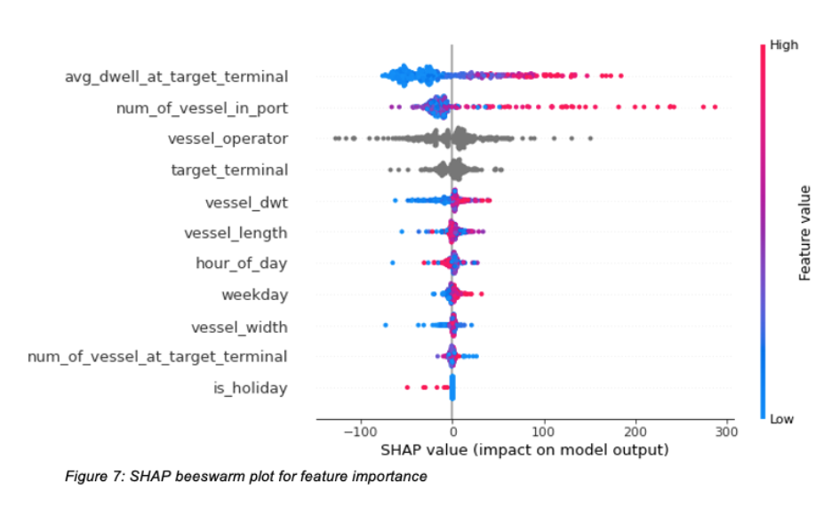
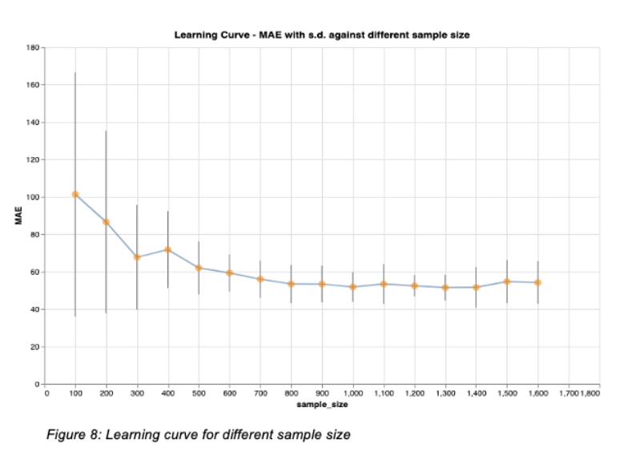
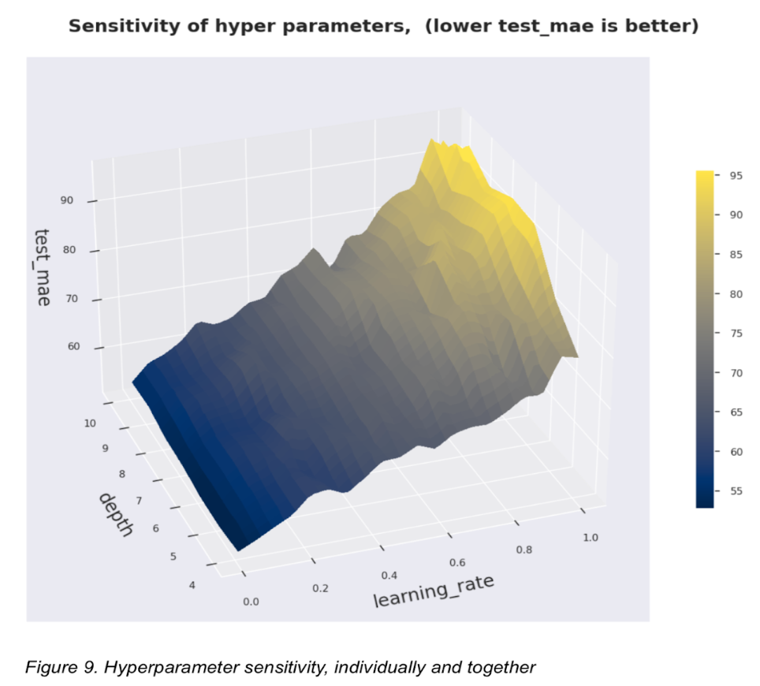

# Container Vessel Port Dwell Time Prediction 

SIADS696 Milestone II Project University of Michigan MADS 

## Introduction

The global supply chain was thrown out of balance by the pandemic, leading to a backlog of cargo and port congestion. This has had worldwide impacts but is especially severe in the US, with an all-time high of 109 container vessels off Port of Los Angeles and Long Beach (LA/LB) on Jan 9 2022 and berthing times taking up to 28 days. Therefore, the Estimated Time of Arrival (ETA) provided by ocean carriers is not able to reflect the extra waiting time for vessels to be berthed.
  
This project aimed to develop a machine-learning model that can predict the dwell time for container vessels to berth. With better predictions from this model, ocean carriers could provide more accurate Estimated Time of Arrival (ETA) information so that downstream logistic companies can have better planning and execution. 

--------------
## Data Source and Scope

<!-- _is_generated.png) -->

**AIS data** is a stream of data with a huge volume, containing vessel information that can be used to trace a vessel's trajectory. The project focused on 6 container terminals in the Port of Long Beach and applied geofence over the data to detect events such as when a vessel arrived at the port area and berthed at a terminal. This was used to calculate dwell time to berth and other useful features for model building.

**Vessel Particular Data** was collected via web scraping based on the vessel identifier available in the AIS Data, containing the basic information about vessels, such as vessel identifier, vessel name, width, length, deadweight tonnage (dwt), vessel type, owner, operator, etc.

--------------
## Feature Engineering Pipline

1. **Filter AIS Data** - apply geofence to filter raw AIS data. We only required data in the port area. Data size reduced from 620GB to 6GB
2. **Resample AIS data** - resample AIS data every 30 min interval. Data size reduced from 6GB to 480MB
3. **Detect port entering time** - apply geofence to detect the port entering time for vessels
4. **Detect vessel berth time** - apply geofence to detect the berth time for vessels
5. **Calculate dwell time to berth** - pair the port entering time and berth time for a vessel in a time interval in order to calculate the dwell time
6. **Generate new features** - calculate new features, e.g. average dwell time for target terminal, number of vessels in the port area, etc. Consolidate AIS data to become 1 record per vessel at the moment when it has entered the port area. Data size reduced from 480MB to 140KB
7. **Merge AIS data with vessel particulars** - join vessel particular data with vessel identifier. Data size increased from 140KB to 200KB

The final output dataset is distilled to 1,653 records.

--------------
## Unsupervised Learning

### Motivation 

Given the mixed type of high dimensional data, we transformed the data and applied dimension reduction in order to visualize the dataset for insight discovery, which includes: a)identifying important features; b)discovery groups of dwell time patterns; and c)other insights that are hard to see. These results can potentially assist in the supervised learning phase.

### Method & Evaluation

Applied and compared three different stratigies for dimension reduction and three algorithms for clustering: Factor Analysis of Mixed Data (FAMD), Principal Component Analysis (PCA), Uniform Manifold Approximation and Projection (UMAP), Agglomerative Clustering, Kmeans, and Density-Based Spatial Clustering of Applications with Noise (DBSCAN). In general, UMAP performed the best, and all the cluster algorithms did pretty well in identifying clusters. 

<!--  -->

Based on the goals of unsupervised learning, we identified several important features that facilitate supervised model training and discovered groups of dwell time patterns along with other interesting insights (*find details in the project report*).

--------------
## Supervised Learning

### Motivation

This part focused on develop a machine learning model to predit the dwell time to berth when a vessel has arrived at the prot area. With the insight from unsupervised learning analysis that the target terminal and the vessel operator contain signals for predicting the dwell time, we formulated the task as a regression supervised learning problem, with the aim of allowing carriers to have a better estimation of the dwell time, enabling better planning and execution for downstream logistic parties.

### Method & Evaluation

We've built the final model over three different types of algorithms: a)Linear Regression; b)Random Forest Regressor; and c)CatBoost Regressor and selected the most accurate one for detailed analysis.

For model training, We used 10-fold cross validation over the training dataset for hyperparameters tuning and trained the models with the best hyperparameters. The table below is the comparison of each model measured using the Mean Absolute Error (MAE).

Overall, The CatBoost model has achieved the lowest MAE. 
  

<!--  -->

Around 64% of errors are within plus or minus 1 day, while around 72% of errors are within plus or minus 2 days, and 82% are within plus or minus 3 days (Chart above).  For the downstream logistic service providers in preparing containers pickup, this range of error sounds acceptable.

--------------
## Further Analysis

### Feature Analysis

<!--  -->

From the feature analysis, we observed the top 4 important features were avg_dwell_at_target_terminal, num_of_vessel_in_port, vessel_operator, and target_terminal.

### Learning Curve Analysis 
  

<!--  -->

To understand whether extra efforts are needed for collecting more training data, We’ve conducted a Learning Curve Analysis, and the result showed that the 2.5 years of AIS data we have used is enough for this CatBoost model,no need to spend extra effort in collecting more sample data.

### Sensitivity Analysis

<!--  -->

In addition, we performed a sensitivity analysis to diagnose how sensitive the hyperparameters are, and the results showed that, overall, our model generalizes well given new test data.

--------------
## Error Analysis

To understand what failures our model has made in order to gain insights on how we can improve our solution, we conducted an Error Analysis.

We found that avg_dwell_at_target_terminal and num_of_vessel_in_port features were not able to catch up with the extended long dwell time during an abnormal period (Oct to Dec 2021). Second, num_of_vessel_in_port feature was capped at around 180 despite a drastic increase in dwell time due to its maximum capacity. Additionally, we also identified that avg_dwell_at_target_terminal feature was not able to accurately capture changes in actual dwell time within a 14 days time window. With limited time and computational power, we didn't search AIS data for other potential waiting areas for overflowed vessels outside the designated port areas, which may affect the accuracy of results when ports reached its maximum capacity during a highly congested situation. 

--------------
## A detailed report on our project can be found here:

[SIAD 696 Milestone2 Project Report - Container Vessel Port Dwell Time Prediction](Project Report Updated.pdf)

## License

All data sources and python libraries used are open source to the best of our knowledge.
